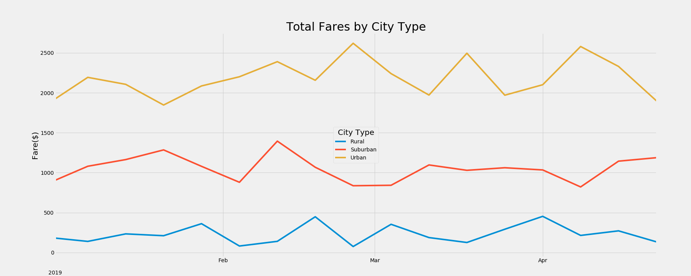

# PyBer_Analysis
PyBer Analysis

## Objective 
Determine if there is a correlation between the average fare and the total rides for each city type for the individual scatter plots, and if there is any statistical significance between the different city types for each box-and-whisker plot. The goals for this challenge are:

* Use Pandas functions like groupby, pivot, resample, and reset_index on a DataFrame.
* Use Pandas methods and attributes on a DataFrame or Series.
* Create a new DataFrame from multiple groupby() Series.
* Format columns of a DataFrame.
* Create a multiple-line graph.
* Annotate and apply styling to the chart.

## Analysis
### Fare Analysis by City Type and Driver Count

Analysis of fares by city type and driver count shows a correlation between city type and average fare. Urban cities have more rides and more drivers, this combination tends to drive down the average fare in urban cities by comparison to suburban and rural cities. Data suggest that areas with less drivers and rides yield a higher average fare and an average fare per driver. While the data suggest this could be due to a longer average distance per ride, further analysis is needed to prove this conclusion. 

### Total Fares by City Type Plot

The plot of total fares by city type over time shows that urban cities are consitently more profitable for the company despite having a lower average fare per driver and per ride. Week over week urban cities generate more than double total fares than suburban cities and more than ten times total fares for rural cities. 
